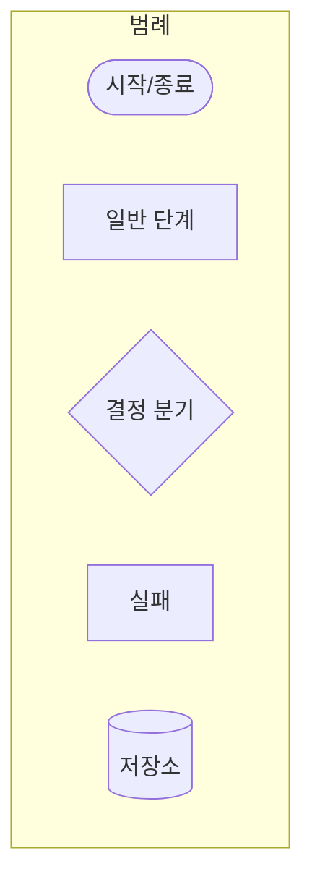

# Mermaid 시각화 규칙

## 적용 대상
- `docs/**/*.md` 중 `\`\`\`mermaid` 블록 포함 파일
- `.claude/skills/**/*.md`, `.claude/agents/**/*.md` 예시 블록
- `prototypes/**/*.md` (해당 시)

## 목표 규칙

### R1. 다이어그램 유형 선택은 "목적" 기반

| 전달 목적 | 권장 타입 |
|---|---|
| 분기 / 판단 / 프로세스 흐름 | flowchart |
| 시간축 상호작용 (외부 연동, callback) | sequenceDiagram |
| 상태 전이 (precheck 4단계, gather lifecycle) | stateDiagram-v2 |
| 데이터 구조 (sections × fields × baseline) | erDiagram |
| 일정·배치 타임라인 | gantt |
| 이벤트 순서 이력 (Round 진행) | timeline |
| 후보안 평가 | quadrantChart |
| 양적 흐름 (벤더 어댑터 매트릭스) | sankey |
| 모듈 의존성 | block-beta 또는 flowchart BT |

### R2. 가시성 강제

모든 style/classDef에:
```
color:#000, stroke-width:2px, fill:<파스텔 색>
```

### R3. 색상 팔레트

| 의미 | fill | stroke |
|---|---|---|
| OK / 신규 / 성공 | `#dfd` | `#3c3` |
| NG / 실패 / 제거 | `#fdd` | `#c33` |
| 대기 / 분기 | `#ffd` | `#c93` |
| 시작 / 진입 | `#eee` | `#999` |
| 외부 시스템 (Redfish/IPMI/SSH/WinRM/vSphere) | `#def` | `#39c` |

### R4. 시작·종료 형상

- 시작/종료: `([텍스트])` stadium
- 외부 시스템: `[[텍스트]]` subroutine
- 결정: `{텍스트}`
- DB/저장소: `[(텍스트)]`

### R5. 노드 ID 의미 기반

- 금지: A, B, C, X1
- 권장: `START_GATHER`, `CHECK_AUTH`, `SAVE_BASELINE`, `FAIL_PRECHECK`

### R6. 라벨 규칙

- 설명형 한국어
- 특수문자 포함 시 쌍따옴표
- 노드 1개 3줄 이내

### R7. 30노드 / 6단계 이내

초과 시 subgraph 또는 별도 다이어그램.

### R8. 성공 / 실패 / 재시도 모두

flowchart에서 성공만 표시 금지. 실패/재시도/롤백 경로 모두.

### R9. AS-IS / TO-BE 쌍 (변경 시)

기존 변경 / 리팩토링은 AS-IS ↔ TO-BE 쌍 필수.

### R10. 벤더 분기 표현

- `subgraph profile-default / profile-dell / profile-hpe / profile-lenovo / profile-supermicro / profile-cisco`
- common 다이어그램은 "분기가 어디" 만 표시, 실 구현은 vendor-specific 다이어그램

### R11. 상단·하단 문맥

- 앞: `> 이 그림이 말하는 것: <한 문장>`
- 뒤: `> 읽는 법: 방향 ..., 색 ..., 핵심 분기 ...`

### R12. 범례 (3색+ 사용 시)



### R13. 문법 호환성

- `graph TD` / `flowchart TD` 둘 다 허용. 신규는 `flowchart` 권장
- `classDef`와 `style`을 같은 노드에 동시 사용 금지
- 점선: `-.->` 또는 `-. "label" .->`
- 고립 노드 지양

### R14-R17. 타입별 규칙

- **sequenceDiagram**: 한국어 alias, 메시지 라벨 한국어, alt/opt/loop 2단계 이내, Note over 비즈니스 설명
- **stateDiagram-v2**: 상태명 대문자 스네이크, [*] 시작/종료, 전이 라벨에 트리거
- **gantt**: title 한국어, dateFormat YYYY-MM-DD, section 그룹화
- **erDiagram**: 관계식 한 줄당 하나, 카디널리티 일관 (`||--o{` 1:N), self-reference 노드명 2번

## 금지 패턴

- 텍스트 색 미지정 — R2
- flowchart로 모든 목적 강제 — R1
- 약어만의 노드 라벨 — R5
- 성공 경로만 — R8
- AS-IS 없이 TO-BE만 — R9
- classDef + style 중복 — R13

## 리뷰 포인트

- [ ] 타입이 목적에 맞는가
- [ ] color #000 + stroke-width 2px
- [ ] 색상 팔레트 일관
- [ ] 노드 ID 의미 기반
- [ ] 30노드 / 6단계 이내
- [ ] 성공/실패/재시도
- [ ] AS-IS/TO-BE (해당 시)
- [ ] 상단·하단 문맥

## 관련

- skill: `write-feature-flowchart`, `visualize-flow`, `update-flowchart-after-change`
- agent: `feature-flowchart-designer`, `flowchart-reviewer`, `flow-visualizer`
