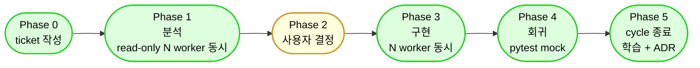

# cycle-orchestrator

## 목적

server-exporter 의 **다중 worker cycle** 메인 오케스트레이터. cycle 2026-05-06 학습 — 사용자 9 작업 항목 → 24 ticket 분해 → 5 worker 동시 진행 → 23 [DONE] + 1 [SKIP] 패턴 라이브러리화.

## 호출 시점

- 사용자 요청이 **3 항목 이상 작업 묶음** (status / 호환성 / vault / vendor 추가 / 학습 등)
- 다중 worker 동시 진행 요구
- 호환성 cycle / 큰 리팩토링 / schema 변경
- 사용자 명시: "cycle 시작", "이 9 가지 작업 ticket 으로 분해", "다음 N cycle 잡아"

## 5 Phase 파이프라인

## Phase 0: ticket 작성 (메인 세션 = orchestrator)

write-cold-start-ticket skill 적용:
1. 디렉터리 `docs/ai/tickets/<YYYY-MM-DD>-<주제>/` 생성
2. INDEX.md / SESSION-HANDOFF.md / DEPENDENCIES.md / SESSION-PROMPTS.md 초안
3. 사용자 N 작업 항목 → M-X# (영역 × round) 분해
4. fixes/M-X#.md 6 절 cold-start 형식 모두 채움 (rule 25 R7-A — Agent 위임 가능, 단 메인이 실측 검증)
5. NEXT_ACTIONS.md 진입점 추가
6. commit: `docs: [<cycle> Session-0 DONE] N ticket 분해`

## Phase 1: 분석 (N worker — 의존 0 ticket 동시)

DEPENDENCIES.md 의 "진행 가능 ticket" list 부터:
- 영역별 read-only 분석 (envelope / 외부 계약 / vault / 호환성 매트릭스 등)
- M-X1 패턴 (영역별 첫 round)
- 동시 N=5 (1 worker = 1 영역 또는 인접 영역 묶음)
- 각 worker: ticket 6 절 모두 채움 + commit 마커 `[SUB-N DONE]`

## Phase 2: 사용자 결정 (메인 세션 단독)

P1 출력 종합:
- 결정 포인트 list (M-X2 패턴 — 의도 결정)
- AI 추천 default 명시 (자율 진행 권한 적용 시)
- 사용자 명시 승인 필요 항목 (rule 92 R5 schema / rule 50 R2 vendor / rule 27 R6 vault decrypt 캐시)

## Phase 3: 구현 (N worker — 결정 후 ticket 동시)

- M-X3 패턴 (영역별 코드 변경)
- Additive only (rule 92 R2 + rule 96 R1-B)
- 정본 4종 (envelope / sections / field_dictionary / build_status) 변경 시 docs/19 + docs/20 + 회귀 mock 동반 갱신 (rule 13 R7 + R8)
- pytest mock fixture N건 추가
- commit 마커 `[SUB-N DONE]`

## Phase 4: 회귀 (메인 세션 또는 별도 worker)

- pytest tests/ -v
- 영향 vendor baseline 회귀
- verify_harness_consistency.py
- envelope shape 보존 (rule 96 R1-B) — `envelope_change_check.py`
- 정본 4종 동기화 (rule 13 R7) — `pre_commit_docs20_sync_check.py`
- status 4 시나리오 (rule 13 R8) — `pre_commit_status_logic_check.py`

## Phase 5: cycle 종료 (메인 세션 — M-G1/G2 패턴)

- HARNESS-RETROSPECTIVE.md 작성 (cycle 학습 N개)
- ADR 작성 (rule 70 R8 trigger 시)
- rule / skill / agent / hook 보강 (M-G2 패턴)
- NEXT_ACTIONS.md 갱신 (P2/P3 후보 list)
- PROJECT_MAP fingerprint 갱신
- final commit + push (github + gitlab 동시)

## 입력

- 사용자 N 작업 항목 list (자유 형식)
- cycle 주제 / 시작일
- worker 동시 진행 수 (default N=5)

## 출력

- 디렉터리 `docs/ai/tickets/<YYYY-MM-DD>-<주제>/` (Phase 0 산출물)
- M-X# ticket 분해 결과 (Phase 0)
- Phase 1 분석 결과 + Phase 2 결정 포인트 (메인 종합)
- Phase 3 구현 commit list
- Phase 4 회귀 결과
- Phase 5 학습 / ADR / NEXT_ACTIONS

## 다중 worker 운영 (rule 25 + 26 정신)

| 항목 | 정책 |
|---|---|
| 오너십 표 | DEPENDENCIES.md 또는 SESSION-HANDOFF.md 의무 |
| 진입 prompt | SESSION-PROMPTS.md (worker N별 cold-start) |
| commit 패턴 | pathspec (`git add <file>` — `git add .` 금지) |
| commit 마커 | `[<ticket-id> DONE]` 또는 `[SUB-N DONE]` |
| 공용 파일 | 순차 편집 (schema / vault / Jenkinsfile) — rule 26 R4 |
| 의심 발견 | FAILURE_PATTERNS.md append-only |
| Agent 보고 | 메인이 실측 검증 (rule 25 R7-A) |

## 사용자 결정 trigger (Phase 2 의무)

다음 발생 시 Phase 2 진입 (Phase 3 자율 진행 차단):
- schema 변경 (sections.yml / field_dictionary.yml — rule 92 R5)
- envelope shape 변경 (rule 13 R5 / rule 96 R1-B)
- 새 vendor 추가 (rule 50 R2)
- vault decrypt 캐시 도입 (rule 27 R6)
- 의도 / 동작 변경 (예: status enum 4종 도입)

→ AI 추천 default 명시 + 사용자 승인 대기.

## cycle 학습 누적 (M-G1 패턴)

매 cycle 종료 시 HARNESS-RETROSPECTIVE.md 의무:
- 학습 N개 (각 학습 = 1 rule / skill / agent / hook 후보)
- P1/P2/P3 분류
- M-G2 에서 P1 즉시 반영, P2/P3 NEXT_ACTIONS 등재
- ADR 작성 (rule 70 R8 trigger 해당 시)

## 관련

- rule 25 (parallel-agents)
- rule 26 (multi-session-guide)
- rule 70 R8 (ADR trigger)
- rule 91 (task-impact-preview)
- rule 92 R5 (schema 변경 사용자 승인)
- rule 96 R1-B (envelope shape 보존)
- skill: write-cold-start-ticket (Phase 0 도구), task-impact-preview (각 ticket 영향 분석), measure-reality-snapshot (Phase 1 실측), update-evidence-docs (Phase 5 정본 갱신)
- agent: ticket-decomposer (Phase 0 sub), wave-coordinator (3-channel 큰 변경 sub)
- hook: pre_commit_ticket_consistency.py (cold-start 6 절 advisory)
- 정본: cycle 2026-05-06-multi-session-compatibility (24 ticket 라이브러리)
