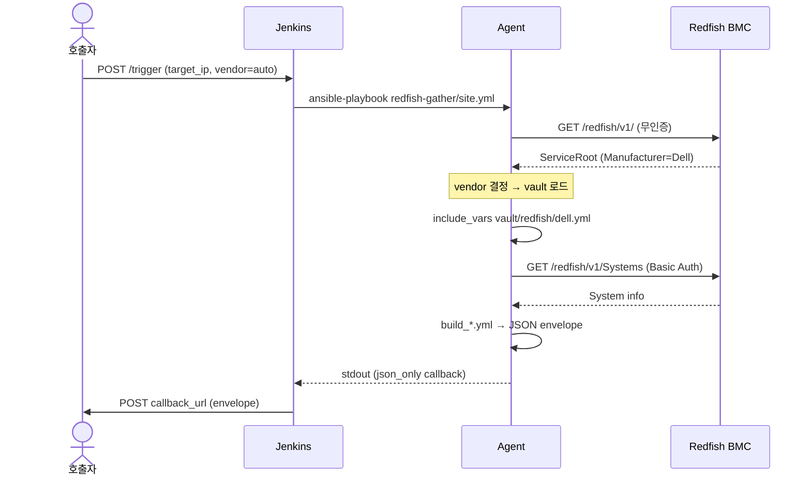

# visualize-flow

## 사용 패턴 (rule 41 R1 목적별)

- **분기 / 흐름**: flowchart
- **시간축 (callback / Vault 2단계)**: sequenceDiagram
- **상태 (precheck 단계 / gather lifecycle)**: stateDiagram-v2
- **데이터 (sections × fields × baseline)**: erDiagram
- **벤더 매트릭스**: sankey
- **후보안**: quadrantChart
- **Round 진행**: timeline / gantt

## server-exporter sequence 예시

## 적용 rule / 관련

- rule 41 (mermaid-visualization)
- skill: `write-feature-flowchart`, `update-flowchart-after-change`
- agent: `flow-visualizer`, `flowchart-reviewer`
