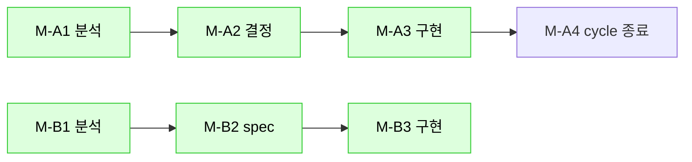

# write-cold-start-ticket

## 목적

다음 세션 (사용자 / AI 모두) 이 **컨텍스트 0 상태로 진입**해서 작업 이어갈 수 있는 ticket 디렉터리 생성. 학습 진화:
- cycle 2026-05-01 학습 — 처음 만든 ticket 일부가 매트릭스만 있고 cold-start 가이드 부족 → 두 번째 cycle 에서 SESSION-HANDOFF + coverage/{section}.md 분리
- cycle 2026-05-06 학습 — 24 ticket 분해 (다중 worker N=5 동시 진행) + 6 절 cold-start 형식 + DEPENDENCIES 그래프 + SESSION-PROMPTS 템플릿 정착

## 호출 시점

- 새 cycle 진입 (호환성 / schema 변경 / 큰 리팩토링)
- gather coverage 전수조사 같은 멀티-round 작업
- 사용자가 "이 cycle ticket 잘 정리해서 다음 세션 시작 가능하게"

## 입력

- cycle 주제 (예: "gather-coverage", "vendor-onboard-huawei", "schema-v2-migration")
- 시작일 (YYYY-MM-DD)
- 추정 round 수 (1 / 다수)

## 출력 디렉터리 구조

```
docs/ai/tickets/<YYYY-MM-DD>-<주제>/
├── INDEX.md                    # cycle 진입점 — 다음 세션이 처음 읽는 문서
├── SESSION-HANDOFF.md          # 직전 세션 종료 시점 상태 + 다음 세션 첫 지시
├── DEPENDENCIES.md             # ticket 의존성 그래프 + 진행 가능 ticket 식별 (cycle 2026-05-06 정착)
├── SESSION-PROMPTS.md          # 각 worker 세션 진입 prompt 템플릿 (cycle 2026-05-06 정착)
├── COMPATIBILITY-MATRIX.md     # (호환성 cycle) 적용 매트릭스 추적
├── LAB-INVENTORY.md            # (선택) lab 보유 / 부재 영역 sanitized
├── HARNESS-RETROSPECTIVE.md    # (선택) cycle 종료 회고
├── coverage/                   # (전수조사 cycle) 영역별 분리
│   ├── MATRIX-R1.md ~ MATRIX-RN.md
│   ├── {section}.md            # power / users / cpu / memory / ...
└── fixes/                      # 개별 fix ticket (P0/P1/P2/P3 또는 영역별 M-X#)
    ├── INDEX.md                # ticket 분류 + 진행 상태
    ├── F01.md ~ F##.md         # 호환성 cycle: 영역 무관 fix
    └── M-A1.md ~ M-G2.md       # 영역 분류 cycle: 영역(A=status, B=계정, C=vault, ...) × round(1~)
```

## INDEX.md 필수 섹션

1. **목적** (1~2 문장)
2. **현재 상태** (시작일 / 진행 round / 완료 / 잔여)
3. **cold-start 가이드** — 다음 세션 처음 읽을 순서 (3~5 문서 list)
4. **티켓 구조 요약** — 위 디렉터리 구조 표
5. **결정 의존** (사용자 / 외부 의존 분리)
6. **갱신 history**

## SESSION-HANDOFF.md 필수 섹션

1. **마지막 commit / 시점** (sha + 메시지 + 일시)
2. **이번 cycle 종료 상태** (round / fix 수)
3. **다음 세션 첫 지시 템플릿** (사용자가 복붙 가능한 한 줄)
4. **차단 사유** (외부 의존 / 사용자 결정)
5. **검증 통과 여부** (pytest / verify_harness_consistency / etc.)

## coverage/{section}.md 형식 (호환성 cycle 시)

```markdown
# coverage — <section>

## 영역 정의
<DMTF / vendor docs reference>

## 우리 코드 현재 동작
- 위치: <file:line>
- path: <외부 endpoint>
- fallback 적용: <yes/no — 적용된 cycle 명시>

## fix 후보
| ID | 우선 | 작업 | 검증 |
|---|---|---|---|
| F## | P# | ... | ... |

## sources (rule 96 R1)
- vendor docs: ...
- DMTF: ...
- evidence: tests/evidence/...
```

## 절차

### 1. 디렉터리 생성
```bash
mkdir -p docs/ai/tickets/<YYYY-MM-DD>-<주제>/{coverage,fixes}
```

### 2. INDEX.md 초안
- 위 6 섹션 모두 포함
- "현재 상태" 는 시작 시 `(round 0, fix 0)`

### 3. SESSION-HANDOFF.md 초안
- 시작 시점은 placeholder ("cycle 시작 — 첫 round 진입 직전")
- 매 round 종료 시 갱신

### 4. coverage/ 또는 fixes/ 채움
- 호환성 cycle: coverage/{section}.md 13 영역 또는 그 이상
- fix cycle: fixes/F##.md 개별 ticket

### 5. NEXT_ACTIONS.md 진입점 추가
- 상단에 본 cycle entry + INDEX.md 링크

### 6. cycle 종료 시
- HARNESS-RETROSPECTIVE.md (선택) — 2주 회고 / 부족점 / 학습
- INDEX.md 의 "현재 상태" 갱신
- SESSION-HANDOFF.md 마지막 commit / 다음 지시 템플릿 채움

## ticket fixes/M-X#.md 6 절 cold-start 형식 (cycle 2026-05-06 정착)

영역별 분류 cycle (호환성 cycle 외 — 다중 영역 동시 진행) 의 개별 ticket 은 **6 절 형식** 의무:

```markdown
# M-X# — <ticket 주제> (read-only 분석 / 구현 / 회귀 등)

> status: [TODO/WIP/DONE/SKIP] | depends: <다른 ticket id> | priority: P# | cycle: <cycle 명>

## 1. 사용자 의도
> "<사용자 원문 인용>"

## 2. 작업 범위
| 항목 | 내용 |
|---|---|
| 영향 모듈 | <file path list> |
| 영향 vendor | <vendor list 또는 "agnostic"> |
| 함께 바뀔 것 | <테스트 / 문서 / adapter> |
| 리스크 top 3 | (1) ... (2) ... (3) ... |
| 진행 확인 | <사용자 결정 여부> |

## 3. 분석 결과 / 구현 spec
<상세 분석 또는 구현 명세>

## 4. 사용자 결정 N 포인트 (있으면)
| option | 의미 | 영향 |
|---|---|---|
| (a) ... | ... | ... |
**AI 추천 default**: ...

## 5. 회귀 / 검증
- pytest 추가 N건
- 정적 검증: <명령>
- 의심 발견: <0건 또는 list>

## 6. 다음 세션 첫 지시 템플릿
```
M-X#+1 진입.
cold-start: SESSION-PROMPTS.md + fixes/M-X#+1.md + M-X# 분석 결과 (절 #3)
자율 진행 default: <AI 추천>
근거: <rule 인용>
작업: <구체적 step>
```

## 관련
- rule N (...)
- skill: ...
- 정본 코드: ...
- 회귀 fixture: ...
```

→ 6 절 모두 채워야 다음 세션 cold-start 진입 가능.

## DEPENDENCIES.md 형식 (cycle 2026-05-06 정착)

```markdown
# DEPENDENCIES — <cycle 명>

## ticket 의존 그래프



## 진행 가능 ticket (의존 0 또는 의존 모두 [DONE])
- M-A1, M-B1, M-C1 (read-only 분석 — 동시 진행)
- M-D1, M-E1, M-F1 (의존 없음 — 동시 진행)

## 차단 ticket (사용자 결정 필요)
- M-A2 → 결정 4 포인트 (M-A1 출력)

## 외부 의존
- lab 도입 시: M-X4 회귀 / Round 검증
```

## SESSION-PROMPTS.md 형식 (cycle 2026-05-06 정착)

```markdown
# SESSION-PROMPTS — <cycle 명>

## Session-N (worker N) 진입 prompt

```
<cycle 명> Session-N 진입.

cold-start:
- INDEX.md (cycle 진입점)
- DEPENDENCIES.md (의존성 그래프)
- fixes/M-X#.md (담당 ticket)

오너십:
- 담당: <ticket id list>
- 영역: <파일 영역>

자율 진행:
- ticket 6 절 모두 채움
- 정적 검증 + 회귀 추가
- commit 메시지: "<type>: [<ticket id> DONE] <summary>"

차단:
- 사용자 결정 필요 시 SESSION-HANDOFF.md 의 "사용자 결정" 섹션 갱신 + 진행 보류
```

## 다중 worker 동시 진행 가이드 (rule 25 + 26 정신)
- 오너십 표 명시 (rule 26 R2)
- pathspec commit (rule 26 R3) — `git add .` 금지
- 공용 파일 순차 (rule 26 R4)
- [SUB-N DONE] commit 마커 (rule 26 R7)
```

## 학습 (cycle 진화 누적)

### cycle 2026-05-01
- 매트릭스만 있는 ticket → 다음 세션 진입 시 어디서 시작할지 모름
- coverage/{section}.md 분리 → 영역별 독립 작업 가능
- SESSION-HANDOFF "다음 세션 첫 지시 템플릿" → 사용자 인지 부담 0
- HARNESS-RETROSPECTIVE → 2주 단위 부족점 검출

### cycle 2026-05-06
- 24 ticket 분해 (영역 7 × round 1~6) → 다중 worker N=5 동시 진행 가능
- 6 절 형식 (사용자 의도 / 작업 범위 / 분석 / 결정 / 회귀 / 다음 지시) 정착
- DEPENDENCIES 그래프 (mermaid) → 진행 가능 ticket 즉시 식별
- SESSION-PROMPTS 템플릿 → worker 진입 cold-start 0
- M-X# 분류 (영역 × round) → 호환성 F## 분류와 분리

## 관련

- rule 25 R7-A (Agent 보고 실측 검증)
- rule 26 R6 (CONTINUATION.md 5 섹션)
- rule 26 R10 (다중 worker 4 정본 — write-cold-start-ticket 의존)
- rule 70 R1 (변경 종류 → 갱신 대상 매핑)
- rule 91 (task-impact-preview)
- agent: docs-sync-worker (ticket 갱신 위임), ticket-decomposer (cycle-orchestrator sub)
- skill: capture-site-fixture (fixture 절차), cycle-orchestrator (cycle 자동화)
- hook: pre_commit_ticket_consistency.py (cold-start 6 절 검증)
