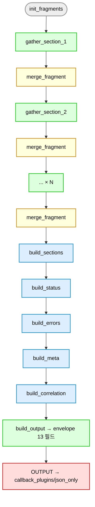

# common/tasks/normalize/ — Fragment 정규화 빌더

> 각 gather 가 자기 fragment 만 만들고 (rule 22), 본 디렉터리의 빌더들이 fragment → 누적 변수 → envelope 13 필드 (rule 13 R5) 로 조립.

## 8 빌더 역할표

| 파일 | 입력 | 출력 | 책임 |
|---|---|---|---|
| `init_fragments.yml` | (없음) | `_merged_data` 빈 skeleton + 누적 list 5개 | gather 시작 시 누적 변수 초기화 (의무 호출) |
| `merge_fragment.yml` | `_data_fragment` + 5 fragment list | `_merged_data` + 5 누적 list 갱신 | 각 gather 후 fragment → 누적 변수 병합 (의무 호출) |
| `build_sections.yml` | `_all_sec_supported / collected / failed / unsupported` | `_norm_sections` (10 sections × success/failed/not_supported) | 섹션별 status 매트릭스 |
| `build_status.yml` | `_norm_sections`, `_norm_errors` | `_out_status` (success/partial/failed) | 4 시나리오 A/B/C/D (rule 13 R8) |
| `build_errors.yml` | `_all_errors` | `_norm_errors` (정규화된 errors 리스트) | error 정규화 + dedup |
| `build_meta.yml` | `_started_at`, `_selected_adapter`, ansible_version 등 | `_meta` (started_at / finished_at / duration_ms / adapter_id / adapter_version / ansible_version) | meta 6 필드 |
| `build_correlation.yml` | `_merged_data.system`, `_out_ip` 등 | `_correlation` (serial_number / system_uuid / bmc_ip / host_ip) | correlation 4 필드 |
| `build_output.yml` | 위 모든 결과 | `_output` (envelope 13 필드 — **정본**) | 최종 envelope 조립 + OUTPUT task 로 emit |
| `build_empty_data.yml` | (없음) | `_norm_empty_data` (rescue 경로용 빈 skeleton) | rescue 시 _merged_data 대체 |
| `build_failed_output.yml` | rescue 컨텍스트 | `_output` (status=failed envelope 13 필드) | 완전 실패 시 fallback envelope |

> 8 → 10 파일이 됐지만 핵심 흐름은 8 빌더. `build_empty_data` 와 `build_failed_output` 은 rescue 경로 보조.

## 호출 순서 (정상 path)



## 회귀 차단 (cycle 2026-05-07 추가)

3 skeleton 파일 (init_fragments / build_empty_data / build_failed_output) 의 data skeleton 동기화 검증:
```bash
python scripts/ai/hooks/pre_commit_fragment_skeleton_sync.py --all
```

## Fragment 변수 정본 (rule 22 R7)

각 gather 가 set 하는 5 변수 (변수 이름 공통, 값으로 자기 섹션):
- `_data_fragment` (dict)
- `_sections_supported_fragment` (list)
- `_sections_collected_fragment` (list)
- `_sections_failed_fragment` (list)
- `_errors_fragment` (list)

## 관련 문서

- `docs/07_normalize-flow.md` — 정규화 흐름 정본
- `docs/13_redfish-live-validation.md` — Round 검증
- `docs/20_json-schema-fields.md` — envelope 13 필드 정본
- `tests/regression/test_cross_channel_consistency.py` — 회귀 보호
