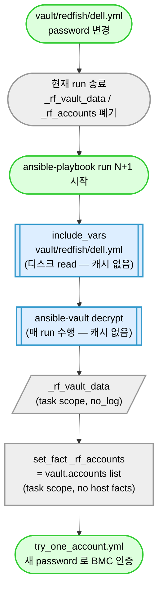

# 21. Vault 운영 — 자격증명 관리

## 누가 읽나

server-exporter 가 SSH / WinRM / vSphere / Redfish 에 접속할 때 쓰는 **자격증명** 을 다루는 사람.

가장 자주 묻는 3가지:

1. vault 파일을 고쳤는데 다음 실행에 정말 반영되나?
2. 정기 회전 (rotate) 어떻게 하나?
3. 새 벤더 추가 시 vault 어떻게 만드나?

이 문서를 끝까지 읽으면 다 푼다.

---

## 1. "vault 고쳤는데 정말 반영됨?" — 한 줄 답

**그렇다. 다음 `ansible-playbook` 실행부터 바로 적용된다.** 별도 캐시 무효화 작업 / 재기동 / 환경변수 갱신 필요 없다.

이유: server-exporter 는 vault 결과를 어디에도 캐시하지 않는다. 매 실행마다 ansible-vault 가 디스크에서 읽어서 복호화한다.

### 의심될 때 직접 확인하는 3가지

운영 중 "정말 반영된 게 맞나?" 가 의심되면 다음 3가지를 차례로 본다. 모두 "0 결과" 가 정상.

---

## 3. Vault 종류

| 채널 | vault 파일 | 용도 |
|---|---|---|
| Linux | `vault/linux.yml` | SSH 자격증명 (host 공통) |
| Windows | `vault/windows.yml` | WinRM 자격증명 (host 공통) |
| ESXi | `vault/esxi.yml` | vSphere 자격증명 (host 공통) |
| Redfish | `vault/redfish/{vendor}.yml` | BMC 자격증명 (vendor별) |

**vendor 9 vault** (cycle 2026-05-11 시점 — M-A1~A6 적용 완료):
- dell.yml, hpe.yml, lenovo.yml, supermicro.yml, cisco.yml (5 base vendor — primary infraops/Password123! 통일)
- huawei.yml, inspur.yml, fujitsu.yml, quanta.yml (cycle 2026-05-11 신설 4 vendor — primary infraops + recovery vendor 공장 기본)

## 4. Vault 자동 반영 메커니즘 (rule 27 R6)

### 4.1 자동 반영 보장 3 단서

vault 변경 시 다음 run 자동 반영을 보장하는 3 단서. 회전 후 / 의심 시 검증:

#### 단서 1: include_vars cacheable 옵션 부재

```bash
grep -rn 'cacheable' redfish-gather/tasks/load_vault.yml
# 기대: 0 결과
```

- `cacheable: yes` 시 fact_cache (Redis) 에 host facts 로 저장 → 다음 run 에서도 stale vault 사용 위험
- 정본: `redfish-gather/tasks/load_vault.yml:29-36` (`include_vars` 호출에 `cacheable` 옵션 없음 — 매 run 디스크 read)

#### 단서 2: set_fact host facts 미등록

```bash
grep -rn 'cacheable' redfish-gather/tasks/load_vault.yml common/tasks/normalize/
# 기대: 0 결과
```

- `_rf_accounts` / `_rf_vault_data` 변수는 task scope 만
- host facts (`ansible_facts.*`) 또는 `cacheable: yes` 등록 금지
- 정본: `redfish-gather/tasks/load_vault.yml:64-81` (`set_fact` 에 `cacheable` 옵션 없음)

#### 단서 3: ansible-vault decrypt 캐시 부재

```bash
grep -rn 'vault_password_file\|vault_identity\|VAULT_PASSWORD_FILE' ansible.cfg
# 기대: vault_password_file 만 있어야 함 (decrypt 캐시 옵션 없음)
```

- Ansible 은 vault decrypt 결과 캐시 안 함 (default)
- vault password file 만 있고 decrypt 결과 캐시 옵션 없으면 매 run 새로 decrypt

### 4.2 자동 반영 흐름 (Mermaid)

> 이 그림이 말하는 것: vault/redfish/{vendor}.yml 파일을 매 ansible run 마다 새로 읽어 `_rf_accounts` 로 정규화한다. 캐시 없음 — 다음 run 자동 반영.



### 4.3 단일 run 내 vault 변경 (반영 안 됨)

- 한 run 시작 후 vault 파일을 mid-run 변경해도 같은 run 내 반영 안 됨 (이미 include_vars 한 후 task 변수 캐시)
- 다음 run 부터 반영
- → **회전은 ansible-playbook 종료 후 수행 권장**

## 5. Vault 회전 시나리오

상세 절차는 `rotate-vault` skill 참조. 본 절은 운영 요약.

### 5.1 시나리오 A: ansible-vault password rekey (vault 자체 password 변경)

```bash
# 1. 백업
cp vault/redfish/dell.yml /tmp/dell-vault.bak

# 2. 새 password 로 rekey
ansible-vault rekey vault/redfish/dell.yml

# 3. Jenkins credentials 갱신 (ANSIBLE_VAULT_PASSWORD)
# 4. 검증
ansible-vault view vault/redfish/dell.yml
```

### 5.2 시나리오 B: 외부 BMC 사용자 자격증명 회전

```bash
# 1. 외부 시스템 (BMC iDRAC / iLO / XCC / CIMC) 에서 사용자 password 변경
#    (BMC 운영자가 수행 — server-exporter 는 read-only)

# 2. 새 자격증명으로 vault 다시 encrypt
ansible-vault edit vault/redfish/dell.yml
#    안에서 vault_redfish_password 또는 accounts[].password 갱신

# 3. 검증 — 다음 ansible run 에서 자동 반영
ansible-playbook redfish-gather/site.yml \
  -i ... -e "target_ip=10.x.x.1" \
  --vault-password-file ~/.vault_pass

# 4. evidence 기록
echo "$(date +%Y-%m-%d): Dell vault rotation (BMC user 변경)" \
  >> tests/evidence/vault-rotation-log.md
```

### 5.3 시나리오 C: 새 vendor vault 추가

`rule 50 R2` 9단계 중 4단계.

```bash
ansible-vault create vault/redfish/{vendor}.yml
# 안에 입력:
# accounts:
#   - username: "infraops"
#     password: "..."
#     label: "primary"
#     role: "primary"
#   - username: "admin"
#     password: "..."
#     label: "recovery"
#     role: "recovery"
```

## 6. 회전 주기 권고

| Vault | 권장 주기 |
|---|---|
| ansible-vault password (마스터) | 분기 |
| BMC / Linux / Windows / ESXi 자격증명 | 반기 또는 사고 시 |
| 새 vendor vault | 추가 시점 (rule 50 R2 9단계) |

## 6.5. 9 vendor recovery 자격 매트릭스 (cycle 2026-05-11 — M-A1~A6)

> 사용자 명시 (2026-05-11): vendor 공장 기본 자격으로 vault 임시 recovery 자격을 추가. primary infraops 비밀번호 `Password123!` 통일.
>
> 본 매트릭스는 **공장 기본 / 매뉴얼 default** 출처. 사이트 BMC 가 customer-specific 자격으로 변경되면 recovery 는 BMC reset 후 회복 시점에만 작동.

### 9 vendor 통일 정책

| 항목 | 값 |
|---|---|
| primary username | `infraops` (모든 vendor 통일) |
| primary password | `Password123!` (cycle 2026-05-11 — 사용자 명시) |
| vault password (ansible-vault) | `Goodmit0802!` |
| recovery 정책 | vendor 공장 기본 자격 + (기존) lab/사이트 운영 자격 (Additive) |

### vendor 별 recovery 자격 (공장 기본)

| vendor | recovery 자격 | label | source (rule 96 R1-A) |
|---|---|---|---|
| **Dell** | root / calvin | `dell_fallback_2` | Dell PowerEdge / iDRAC 공식 매뉴얼 (역사적 default) |
| **HPE** | admin / admin | `hpe_factory` | HPE iLO User Guide (legacy default — iLO5+ 첫 로그인 강제 변경) |
| **Lenovo** | USERID / PASSW0RD | `lenovo_factory` | Lenovo XCC / IMM User Guide ('0' = 숫자 zero) |
| **Supermicro** | ADMIN / ADMIN | `supermicro_factory` | Supermicro BMC User Guide (일부 펌웨어는 sticker 별도) |
| **Cisco** | admin / password | `cisco_factory` | Cisco UCS / CIMC User Guide |
| **Huawei** | Administrator / Admin@9000 | `huawei_factory` | Huawei iBMC Redfish API user guide |
| **Inspur** | admin / admin | `inspur_factory` | Inspur server BMC user guide |
| **Fujitsu** | admin / admin | `fujitsu_factory` | Fujitsu PRIMERGY iRMC user guide |
| **Quanta** | admin / admin | `quanta_factory` | Quanta QCT server user guide |

### 기존 vendor 의 다중 recovery (보존 — Additive only)

5 사이트 검증 vendor 는 cycle 2026-04-29 ~ 2026-05-06 누적된 lab / 사이트 운영 자격이 보존됨:
- **Dell**: 4 recovery (dell_fallback_1, dell_fallback_2, dell_current, lab_dell_root)
- **HPE**: 3 recovery (hpe_fallback, hpe_current, hpe_factory)
- **Lenovo**: 3 recovery (lenovo_fallback, lenovo_current, lenovo_factory)
- **Supermicro**: 1 recovery (supermicro_factory — cycle 2026-05-11 신규)
- **Cisco**: 2 recovery (cisco_current, cisco_factory)

### vendor default 계정 자동 생성 메커니즘

primary `infraops/Password123!` 자격이 BMC 에 없으면 (= 사이트 BMC 초기 상태) recovery 자격으로 fallback → `account_service.yml` 가 자동으로 BMC 에 `infraops` 계정 + `Password123!` 비밀번호 + `Administrator` role 로 PATCH/POST.

흐름:

```
try_one_account.yml (accounts[0] primary 시도)
  └─ 401 (BMC 에 infraops 없음)
       ↓
try_one_account.yml (accounts[1+] recovery 시도)
  └─ 200 (BMC 공장 기본 자격 → _rf_used_account.role='recovery')
       ↓
account_service.yml (진입 조건: role='recovery' + _rf_collect_ok=true + vault 에 primary 후보 1개 이상)
  └─ redfish_gather mode='account_provision'
       target_username='infraops', target_password='Password123!', target_role='Administrator'
       ↓
BMC AccountService POST/PATCH → infraops 계정 생성/복구
       ↓
다음 ansible run: primary 자격 (infraops/Password123!) 으로 정상 인증
```

→ **사이트 BMC 가 customer-specific 자격으로 변경된 경우**: recovery 매칭 안 됨 → BMC reset 필요 (사이트 운영자) → reset 후 공장 기본 자격 회복 시점에 자동 생성 작동.

### dryrun 정책

- `_rf_account_service_dryrun` (default `false` — cycle 2026-04-30 사용자 명시 승인으로 OFF 전환)
- override: `-e _rf_account_service_dryrun=true` (시뮬레이션 모드 강제)
- 신규 사이트 BMC 1대 처음 적용 시 권장: dryrun ON 으로 시뮬레이션 1회 → dryrun OFF 로 실 적용

## 7. accounts 정규화 (P1 cycle 2026-04-28)

vault file 내 accounts list 순서 = multi-account fallback 시도 순서. 별도 role 정렬 없음.

```yaml
# vault/redfish/dell.yml (예시)
accounts:
  - username: "infraops"
    password: "..."
    label: "primary"
    role: "primary"      # provision target
  - username: "admin"
    password: "..."
    label: "recovery"
    role: "recovery"     # provision 진입용
```

→ `_rf_accounts` 로 정규화. legacy 호환 (`ansible_user` / `ansible_password` → primary 1개).

## 8. 의심 / 사고 대응

### 8.1 자동 반영 안 되는 의심

- 단서 3개 (4.1) 검증 → 0 결과 / 옵션 없음 확인
- ansible run 1회 더 시도 (mid-run 변경은 반영 안 됨)
- vault 파일 디스크 sync 확인 (`ls -la vault/redfish/{vendor}.yml` → mtime 업데이트)
- ansible-vault decrypt 명령 직접 실행 → 새 내용 read 가능 확인

### 8.2 일부 host 인증 실패

- BMC 측 password sync 안 됨 → 외부 시스템 운영자에게 escalate
- multi-account fallback 의 recovery (`accounts[1+]`) 가 동작하는지 확인
- evidence 기록

### 8.3 vault edit 도중 swap 파일 잔재

- `vault/.swp`, `vault/redfish/.{vendor}.yml.swp` 파일 잔재 시 절대 commit 금지
- `.gitignore` 에 `*.swp` 등록 (이미 적용)

## 9. 검증 절차 (회전 후 의무)

1. `ansible-vault view <vault>` — 새 password 로 read 가능
2. dry-run: `ansible-playbook --syntax-check redfish-gather/site.yml`
3. **자동 반영 3 단서 검증** (rule 27 R6) — 4.1 명령 3개
4. 실장비 1대 대상 본 수집 시도 (target_type별)
5. callback 결과 envelope `meta.vendor` 정상
6. console log 평문 password 노출 없음 확인

## 10. 보안 주의

- 회전 절차 중 임시 평문 password 메모는 메모리 only (파일 / clipboard 제거)
- Jenkins credentials 는 server-exporter 외부 (Jenkins controller 권한 최소)
- 회전 이력 = `tests/evidence/vault-rotation-log.md` (날짜 + 대상만, password 자체는 절대 기록 안 함)
- ansible-vault password file (`~/.vault_pass`) 은 `chmod 600`

## 11. 관련 문서

| 문서 | 용도 |
|---|---|
| `rule 27 R6` | vault 자동 반영 단서 3개 정본 |
| `rule 50 R2` | 새 vendor 추가 9단계 |
| `skill: rotate-vault` | 회전 절차 상세 |
| `skill: add-new-vendor` | vendor 추가 시 vault 생성 단계 |
| `skill: debug-precheck-failure` | auth 실패 시 |
| `redfish-gather/tasks/load_vault.yml` | vault 로딩 정본 코드 |
| `docs/03_agent-setup.md` | Agent 보안 설정 |
| `docs/ai/references/ansible/ansible-vault.md` | ansible-vault 명령 reference |

---

## 다음 단계

| 다음 작업 | 문서 |
|---|---|
| Jenkins 마스터의 vault credential 등록 | [01_jenkins-setup.md](01_jenkins-setup.md) §7 |
| Agent 노드 설치 (vault 패스워드 파일 배치) | [03_agent-setup.md](03_agent-setup.md) |
| precheck 4단계 (인증 실패 단계 진단) | [11_precheck-module.md](11_precheck-module.md) |

## 자주 막히는 곳

| 증상 | 원인 / 해결 |
|------|------------|
| 새로 만든 vault 가 반영 안 됨 | `cacheable: yes` / fact_caching 충돌 의심 — rule 27 R6 단서 3개 검증 |
| `Decryption failed` | `.vault_pass` 파일의 패스워드와 vault 가 일치하지 않음 |
| `Could not find credentials entry` | Jenkins Credentials 에 `server-gather-vault-password` 미등록 |
| ansible-vault edit 실패 | 파일이 이미 평문이거나 다른 vault password 로 암호화됨 |
