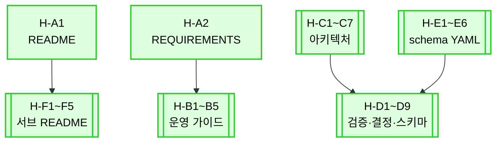

# Dependencies — Human Docs Overhaul

## 의존 그래프 (Mermaid)

## 의존성 표

| Ticket | 차단 (block) | 차단되는 (blocked by) | 비고 |
|---|---|---|---|
| H-A1 README | H-F1~F5 (cross-ref 갱신) | — | 진입점이라 먼저 |
| H-A2 REQUIREMENTS | H-B 시리즈 | — | 운영 가이드가 이 문서 참조 |
| H-B1~B5 | — | H-A2 (권장) | 독립 진행 가능 |
| H-C1~C7 | H-D 시리즈 | — | 아키텍처가 검증/결정 문서의 전제 |
| H-D1~D9 | — | H-C, H-E (권장) | schema 문서가 H-E 의 표현 따름 |
| H-E1~E6 | H-D7 (json-schema-fields) | — | schema 본문 표현 일치 |
| H-F1~F5 | — | H-A1 (권장) | 루트 README 와 cross-ref |

> 실제로는 모두 독립 작업 가능. 위 표는 "권장 순서" 수준.

## 진행 가능 ticket (cycle 시작 시점)

모든 ticket 즉시 진행 가능 — 본 cycle 은 단일 세션이라 의존 충돌 없음.
