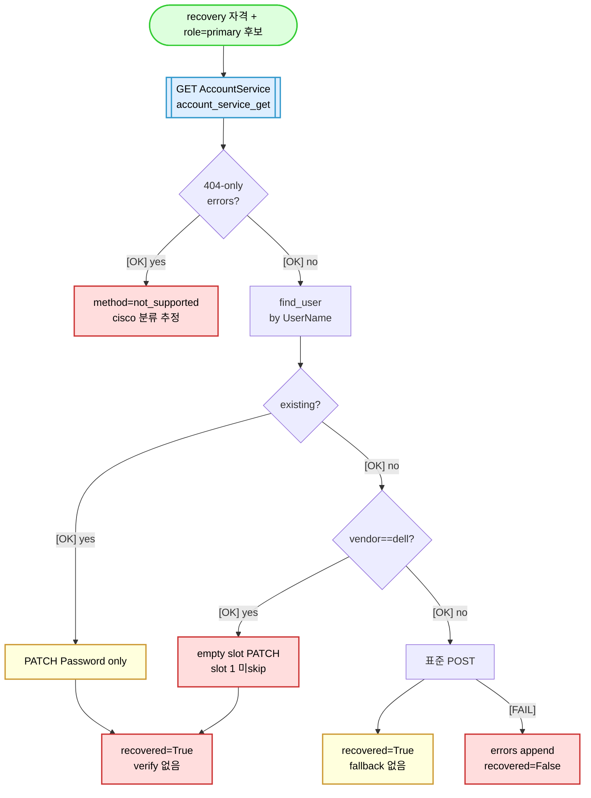
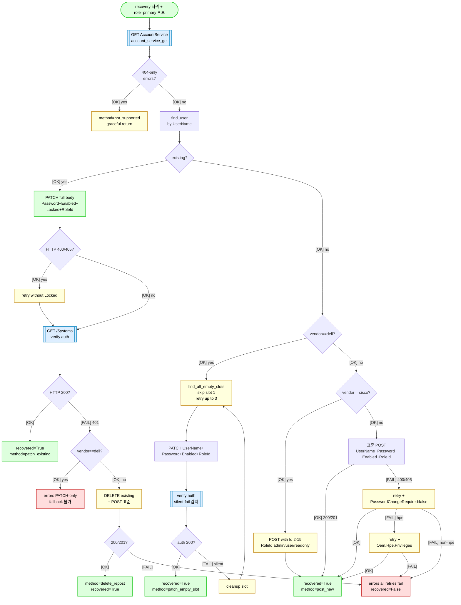

# M-B1 — Redfish 공통계정 (account_provision) flow 분석 (read-only)

> status: [DONE] | depends: — | priority: P1 | cycle: 2026-05-06-multi-session-compatibility

## 사용자 의도

> "redfish 공통계정 생성 및 그것을 이용한 개더링부터 검증해봐."

## 작업 범위

| 항목 | 내용 |
|---|---|
| 영향 모듈 | `redfish-gather/library/redfish_gather.py` (account_service_provision @ line 2157, 호출 @ line 2581), `redfish-gather/tasks/account_service.yml`, `redfish-gather/tasks/load_vault.yml` |
| 영향 vendor | 5 vendor (Dell / HPE / Lenovo / Supermicro / Cisco). F49/F50 호환성 + 신규 vendor 4 (Huawei / Inspur / Fujitsu / Quanta) |
| 함께 바뀔 것 | (분석 only) |
| 리스크 | LOW (read-only) |
| 진행 확인 | M-B2 5 vendor 매트릭스 검증 입력 |

## 사전 컨텍스트 (F49/F50 commit history)

| commit | 의미 |
|---|---|
| `13bcbd5a` | feat: F49 redfish account_provision 호환성 강화 |
| `7144073e` | feat: F50 Cisco AccountService 표준 지원 + infraops 5 vendor 통일 |
| `e6d69538` | feat: F50 phase3 전 vendor 호환성 + Dell BMC OEM DelliDRACCard |
| `3fa39dec` | feat: F50 phase4 Lenovo XCC 권한 cache 손상 fix + verify-fallback |

→ 본 ticket = F49+F50 phase1~4 코드의 5 vendor flow 정적 분석.

## 분석 대상 (Session-0 grep 결과)

### 정의

- `redfish_gather.py:2157` — `def account_service_provision(...)`
- `redfish_gather.py:2581` — 호출 site

### Ansible task

- `redfish-gather/tasks/account_service.yml` (128 lines)
  - flow: vault accounts (role=primary) → vendor 분기 (account_service_provision invoke) → meta 기록 (password 미포함)
- `redfish-gather/tasks/load_vault.yml` (88 lines)
  - flow: `vault/redfish/{profile}.yml` → `_rf_accounts` (vault file 의 list 순서 유지)

### Vault 2단계 (rule 27 R3)

1. ServiceRoot 무인증 GET → vendor 추출
2. vendor 결정 후 `vault/redfish/{vendor}.yml` 동적 로드
3. 인증 본 수집 + account_service_provision (옵션)

## 작업 spec (Session-0 분석 → 산출물)

### (A) account_service_provision flow 다이어그램 (Mermaid — rule 41)

> 이 그림이 말하는 것: F49 (cycle 2026-05-01 호환성 강화) → F50 phase 1~4 (cycle 2026-05-06 5 vendor 통일 + verify-fallback) 변천. AS-IS = F49 시작점 / TO-BE = F50 phase 4.

#### AS-IS (F49 시작점, cycle 2026-05-01)



#### TO-BE (F50 phase 4, cycle 2026-05-06)



> 읽는 법: 방향 위→아래. 색 OK=#dfd 성공 / WARN=#ffd retry / NG=#fdd 실패 / EXT=#def 외부 호출. 핵심 분기: (1) IS_EXIST patch vs post, (2) VERIFY_OK F50 phase 4 신규 권한 cache 손상 감지, (3) vendor 분기 (DELL_BR PATCH-only / CISCO_BR Id+enum / 그 외 표준 POST + retry).

---

### (B) 5 vendor × 10 단계 매트릭스 (F49 / F50 phase 1~4 변경 추적)

| 단계 / vendor | Dell iDRAC9 | HPE iLO5/6 | Lenovo XCC | Supermicro | Cisco CIMC |
|---|---|---|---|---|---|
| 1. AccountService endpoint | /redfish/v1/AccountService/Accounts | 동일 | 동일 | 동일 | 동일 (M5+) |
| 2. 신규 사용자 생성 method | PATCH 빈 slot | POST | POST | POST | POST + Id (1-15) |
| 3. RoleId enum | Administrator | Administrator | Administrator | Administrator | admin / user / readonly (Administrator 거부) |
| 4. reserved slot | slot 1 = anonymous (skip) | 없음 | 없음 | 없음 | slot 1 = admin (skip POST 시) |
| 5. silent-fail 사례 | password complexity 미충족 → PATCH 200 OK 그러나 미적용 (Security Strengthen Policy) | — | password-only PATCH 시 권한 cache 손상 (F50 phase 4) | — | 이전 not_supported 잘못 분류 (F50 phase 1 정정) |
| 6. F49 fix (cycle 2026-05-01) | skip_slot_ids 1 + 다중 slot retry (3개) + verify auth | Oem.Hpe.Privileges 3차 retry | PasswordChangeRequired false 2차 retry | 변경 없음 | 시점 not_supported 유지 |
| 7. F50 phase 1 fix (7144073e) | 변경 없음 | 변경 없음 | 변경 없음 | 변경 없음 | early-return 제거 + Id 자동 검색 (2-15) + RoleId mapping |
| 8. F50 phase 3 fix (e6d69538) | Manager.Oem.Dell.DelliDRACCard 4 필드 추출 (gather_bmc) | 변경 없음 | 변경 없음 | 변경 없음 | 변경 없음 |
| 9. F50 phase 4 fix (3fa39dec) verify-fallback | PATCH-only — DELETE+POST fallback 불가 + errors 명시 | DELETE+POST 재생성 fallback 가능 | password-only PATCH 권한 cache 손상 fix → full body PATCH + verify auth + DELETE+POST fallback | DELETE+POST 재생성 fallback 가능 | DELETE+POST 재생성 fallback 가능 |
| 10. 사이트 실측 결과 | 10.100.15.27 / 10.100.15.31 → recovered=True (slot 3) | 10.50.11.231 → NOOP (이미 primary) | 10.50.11.232 → slot 4 PATCH 200 + verify 200 | (lab 부재) | 10.100.15.2 → slot 2 POST 201 + 인증 200 |

**nosec rule12-r1 분기 위치** (rule 12 R1 Allowed 영역, redfish_gather.py):
- 2283 — Dell DELETE+POST fallback 불가 분기
- 2310 — Cisco delete-repost RoleId 변환
- 2332 — Dell empty slot PATCH 분기 진입
- 2412 — Cisco POST with Id 분기 진입
- 2486 — POST 1차 실패 시 Lenovo PasswordChangeRequired retry
- 2503 — 2차 실패 시 HPE Oem.Hpe.Privileges retry

→ 본 매트릭스 = M-B2 입력 (5 vendor 매트릭스 검증).

---

### (C) infraops_account_provision (cycle 2026-05-01 어휘 — F50 통일 후 동작)

**용어**: infraops = vault accounts list 의 role=primary 첫 entry. cycle 2026-05-01 사용자 명시: redfish 공통계정은 모두 동일해야함 (패스워드도).

**5 vendor 통일 path** (F50 commit 7144073e + e6d69538 + 3fa39dec):

1. **vault 통일** — vault/redfish/{dell,hpe,lenovo,cisco,supermicro}.yml 모두 다음 갱신:
   - username = infraops, role = primary, label = infraops
   - password = Passw0rd1!Infra (15자 — Dell Security Strengthen Policy 호환 — 가장 엄격 기준 채택)

2. **flow 통일** — account_service.yml + redfish_gather.py:
   - account_service_provision 진입 → account_service_get enumerate
   - 기존 infraops 발견 시 → PATCH full body (F50 phase 4 — Password + Enabled + Locked + RoleId 동시)
   - 미발견 시 vendor 분기 후 신규 생성:
     - Dell: patch_empty_slot (slot 1 skip, 2-17 retry up to 3)
     - Cisco: post_new with Id (2-15 빈 검색 + RoleId mapping)
     - HPE / Lenovo / Supermicro / 신규 4종: 표준 POST → 400/405 시 vendor-specific retry

3. **권한 검증 통일** (F50 phase 4 신규):
   - PATCH 200 후 _get Systems target_user target_pass verify auth
   - 401 = 권한 cache 손상 → DELETE+POST 재생성 fallback (Dell 제외)
   - Dell PATCH-only — fallback 불가 → errors 명시 + 운영자 수동 복구

4. **rotate 통일** (account_service.yml line 122):
   - recovered=True 비-dryrun → ansible_user/password rotate to primary creds → _rf_collect_ok=false → collect_standard.yml 재호출
   - 즉, recovery 자격으로 1차 수집 + infraops 복구 + primary 자격으로 재수집 (single playbook 안에서 self-heal)

5. **5/5 BMC 검증 결과** (F50 phase 1 commit 7144073e build #1 / phase 4 commit 3fa39dec build #2):
   - Dell × 2 (10.100.15.27 / 10.100.15.31), HPE × 1 (10.50.11.231), Lenovo × 1 (10.50.11.232), Cisco × 1 (10.100.15.2)
   - 모두 HTTP 200 + used_role=primary 확인

→ infraops_account_provision 어휘는 cycle 2026-05-01 도입 후 F50 phase 1~4 commit 4건에 걸쳐 5 vendor 통일 path 로 정착. 매트릭스 (B) 9~10 단계와 1:1 대응.

---

### (D) 신규 vendor 4 (Huawei iBMC / Inspur iSBMC / Fujitsu iRMC / Quanta QCT BMC) 의 account_service 동작 추정

**lab 부재** (rule 96 R1-A) — adapter priority=80, fixture/baseline 부재. 분석은 web sources + redfish_gather.py fall-through 동작 추정.

| vendor | adapter (priority) | _extract_oem_* 등록 | 추정 path | 신뢰 근거 |
|---|---|---|---|---|
| Huawei iBMC | adapters/redfish/huawei_ibmc.yml (80) | 미등록 (redfish_gather.py:973-979 dispatch 없음) | 표준 POST fall-through (HPE / Lenovo / Supermicro 와 동일 분기) → 400/405 시 Lenovo retry → HPE retry 도달 시 vendor!=hpe 이면 fail | F50 phase 3 commit e6d69538 web sources: support.huawei.com iBMC Redfish API |
| Inspur iSBMC | adapters/redfish/inspur_isbmc.yml (80) | 미등록 | 표준 POST fall-through 동일 | OCP Rack-Manager spec — 표준 Redfish AccountService.v1 호환 |
| Fujitsu iRMC | adapters/redfish/fujitsu_irmc.yml (80) | 미등록 | 표준 POST fall-through 동일 | github.com/fujitsu Server Manager scripts — 표준 POST |
| Quanta QCT BMC | adapters/redfish/quanta_qct_bmc.yml (80) | 미등록 | 표준 POST fall-through 동일 | knusbaum.org QCT Redfish notes — 표준 POST |

**위험 영역** (lab 부재 → 검증 불가):
1. **password complexity** — vendor 별 정책 차이. Dell Security Strengthen Policy 와 같은 silent-fail 가능성. web sources 부재
2. **slot reservation** — Cisco slot 1 admin reserved / Dell slot 1 anonymous reserved 와 같은 vendor-specific 예약 슬롯 가능성
3. **권한 cache 손상** — Lenovo XCC password-only PATCH 와 같은 BMC-specific 동작 가능성 (F50 phase 4 verify-fallback 으로 graceful 처리되긴 함)
4. **POST 거부 enum** — Cisco 처럼 Administrator RoleId 거부 + custom enum 가능성

**M-D2 web 검색 후속 trigger** (rule 96 R1-A — lab 부재 vendor 의 web sources 의무):
- [TODO] Huawei iBMC — support.huawei.com Redfish API guide → POST AccountService body schema + RoleId enum + slot reservation
- [TODO] Inspur iSBMC — OCP Rack-Manager 또는 Inspur 공식 docs → password complexity + lockout policy
- [TODO] Fujitsu iRMC — github.com/fujitsu/iRMC-RestAPI-Tools 또는 manuals.ts.fujitsu.com → 표준 POST 호환성
- [TODO] Quanta QCT BMC — knusbaum.org / Quanta vendor docs → POST 표준 + Id 필드 필요 여부

→ M-D2 (web 검색 gap 영역) 입력. M-D3 (fallback 코드 추가 — additive only, rule 96 R1-B) 에서 확인된 vendor-specific 동작은 nosec rule12-r1 분기 또는 _extract_oem_* dispatch 등록 형태로 반영. lab 부재이므로 사이트 fixture 도달 전까지 web sources origin 주석 의무.


## 회귀 / 검증

- (분석 only)
- 정적 검증: `python -m ast` redfish_gather.py / yamllint account_service.yml

## risk

- (LOW) 분석 누락 시 M-B2 매트릭스 부정확 → M-B3 회귀 불완전

## 완료 조건

- [x] (A) account_service_provision flow Mermaid (AS-IS/TO-BE 쌍, ASCII 태그, color #000 + stroke 2px, 색상 팔레트)
- [x] (B) 5 vendor × 10 단계 매트릭스 (F49 / F50 phase 1~4 변경 추적 + nosec 분기 위치)
- [x] (C) infraops 통일 후 동작 명시 (vault / flow / 권한 검증 / rotate / 5 BMC 검증)
- [x] (D) 신규 vendor 4 의 account_service 동작 추정 + 위험 영역 4 + M-D2 web 검색 후속 TODO
- [ ] commit: `docs: [M-B1 DONE] account_provision flow 5+4 vendor 매트릭스`

## 다음 세션 첫 지시 템플릿

```
M-B1 account_provision flow 분석 진입.

읽기 우선순위:
1. fixes/M-B1.md (본 ticket)
2. redfish-gather/library/redfish_gather.py:2157 (정의)
3. redfish-gather/library/redfish_gather.py:2581 (호출)
4. redfish-gather/tasks/account_service.yml (128 lines)
5. redfish-gather/tasks/load_vault.yml (88 lines)
6. F49 / F50 phase1~4 commit (git log --grep='F49\|F50' --oneline)

산출물 (M-B1.md 의 "작업 spec" 절 채움):
- (A) flow 다이어그램
- (B) 5 vendor 매트릭스
- (C) infraops 통일 동작
- (D) 신규 4 vendor 추정 + web 검색 trigger
```

## 관련

- rule 12 R1 (vendor 경계 — Allowed 영역)
- rule 27 R3 (Vault 2단계 로딩)
- rule 41 (Mermaid 시각화)
- skill: validate-fragment-philosophy
- 정본: `docs/13_redfish-live-validation.md`
