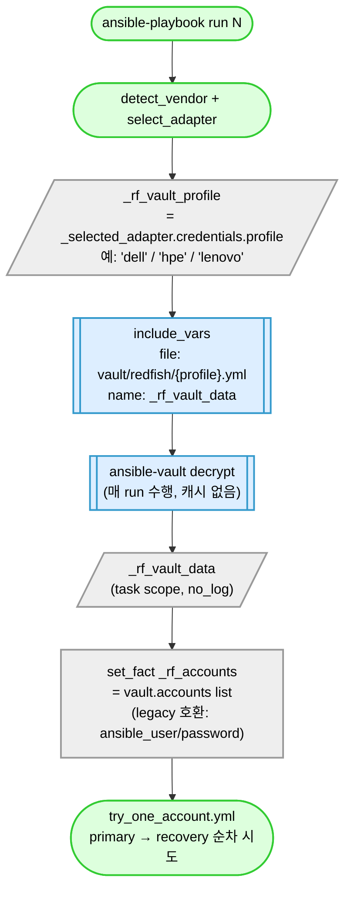

# M-C1 — Vault 동적 로딩 분석 (read-only)

> status: [DONE] | depends: — | priority: P1 | cycle: 2026-05-06-multi-session-compatibility

## 사용자 의도

> "redfish 공통계정의 패스워드가 vault 가 변경됐다면 자동으로 변경되는지 확인하고."

→ vault/redfish/{vendor}.yml 파일 변경 시 다음 ansible 실행 때 자동 반영되는지 검증.

## 작업 범위

| 항목 | 내용 |
|---|---|
| 영향 모듈 | `redfish-gather/tasks/load_vault.yml` (88 lines), `redfish-gather/site.yml` (vault 로딩 흐름), `vault/redfish/<vendor>.yml` (정본 — 자동 반영 대상) |
| 영향 vendor | 9 vendor 모두 (모두 동일한 load_vault.yml 사용) |
| 함께 바뀔 것 | (분석 only) |
| 리스크 | LOW (read-only) |
| 진행 확인 | M-C2 cache invalidation 분석 입력 |

## Session-0 분석 결과 (load_vault.yml flow)

### 정본: `redfish-gather/tasks/load_vault.yml`

```yaml
- name: "redfish | load_vault | include vault (primary)"
  ansible.builtin.include_vars:
    file: "{{ lookup('env','REPO_ROOT') }}/vault/redfish/{{ _rf_vault_profile }}.yml"
    name: _rf_vault_data
  no_log: true
  failed_when: false
```

### 핵심 메커니즘

1. **매 실행 마다 include_vars** — Ansible 의 `include_vars` 는 task run 마다 파일을 읽음 (캐시 없음)
2. **set_fact `_rf_accounts`** — vault 파일 내용을 task 변수로 정규화. 이 변수는 host facts cache 에 저장되지 않음 (task 변수, task run scope)
3. **fact_cache (Redis) 영향 없음** — `gather_facts` 결과만 fact_cache 됨. `set_fact` 는 host run scope (다음 실행 시 새로 set_fact)

### 결론 (예비)

- vault/redfish/{vendor}.yml 변경 시 → **다음 ansible-playbook 실행에서 자동 반영**
- ansible-vault encrypt/decrypt 도 매번 수행 (캐시 없음)
- single playbook run 내에서 vault 파일 중간 변경은 반영 안 됨 (이미 include_vars 한 후에는 `_rf_vault_data` 가 task 변수 캐시)

→ 사용자 질문 "자동으로 변경되는지" 의 답: **YES (다음 실행부터)**.

### 의심 영역 (M-C2 검증 대상)

1. **fact_cache (Redis) 의 영향** — `_rf_accounts` 가 set_fact 라 host facts 가 아닌데, 누군가 `cacheable: yes` 옵션 줬는지?
2. **Ansible host vars 영향** — vault profile (`_rf_vault_profile`) 이 `_selected_adapter.credentials.profile` 에서 오는데, adapter 자체가 캐시되는지?
3. **multi-account fallback** — vault accounts list[0] (primary) 변경 시 / list[1+] (recovery) 변경 시 어느 쪽이 사용?
4. **encrypted vault decrypt 캐시** — ansible-vault decrypt 결과 캐시되는지 (보통 X 이지만 검증)
5. **F50 phase4 권한 cache 손상 fix** — Lenovo XCC 권한 cache 가 vault 와 별개. 이는 BMC 측 cache 문제이지 vault 자동 반영 문제 아님

## 작업 spec

### (A) load_vault flow 다이어그램 (Mermaid — rule 41)

> 이 그림이 말하는 것: vault/redfish/{vendor}.yml 파일을 매 ansible run 마다 새로 읽어 `_rf_accounts` 로 정규화한다. 캐시 없음 — 다음 run 자동 반영.

**AS-IS (현재 동작 = 정상)**



**TO-BE (vault file 변경 후 다음 run — AS-IS 와 동일 흐름, 매번 새로 읽음)**

```mermaid
flowchart TD
    EDIT([vault/redfish/dell.yml<br/>accounts[0].password 변경]):::ok
    RUN_N([run N 종료<br/>_rf_vault_data / _rf_accounts 폐기]):::default
    RUN_NP1([ansible-playbook run N+1 시작]):::ok
    INC2[["include_vars<br/>(파일 다시 읽음 — disk read)"]]:::ext
    DECRYPT2[["ansible-vault decrypt<br/>(다시 수행)"]]:::ext
    NEW_DATA[/"_rf_vault_data<br/>= 새 password 반영"/]:::default
    NEW_NORM["_rf_accounts<br/>= 새 password 후보"]:::default
    NEW_TRY([try_one_account<br/>새 password 로 BMC 인증]):::ok

    EDIT --> RUN_N --> RUN_NP1 --> INC2
    INC2 --> DECRYPT2 --> NEW_DATA --> NEW_NORM --> NEW_TRY

    classDef ok fill:#dfd,stroke:#3c3,stroke-width:2px,color:#000
    classDef default fill:#eee,stroke:#999,stroke-width:2px,color:#000
    classDef ext fill:#def,stroke:#39c,stroke-width:2px,color:#000
```

> 읽는 법: 위→아래 시간 흐름. 녹색 = 성공 / 회색 = 일반 / 파랑 = 외부 (disk read / vault decrypt). vault file 변경 후 별도 invalidation step 없이 다음 run 자동 반영.

### (B) cache 영역 매트릭스

| # | 변수 / 캐시 | 캐시 위치 (scope) | TTL | invalidation trigger | vault 변경 자동 반영? |
|---|---|---|---|---|---|
| 1 | `_rf_vault_data` | task scope (include_vars name=) | task run 종료 시 폐기 | 매 task 진입 시 새로 include_vars | YES — 매 run include_vars 가 file 다시 읽음 |
| 2 | `_rf_accounts` | host scope (set_fact 기본) — `cacheable: yes` 미지정 | host run 종료 시 폐기 | 매 ansible run 새로 set_fact | YES — `_rf_vault_data` 새로 읽힘 → 매번 재계산 |
| 3 | `_rf_vault_profile` | host scope (set_fact) — `cacheable: yes` 미지정 | host run 종료 시 폐기 | adapter 선택 결과 변경 시 | adapter 자체는 매 run lookup → 영향 없음 |
| 4 | host facts (gather_facts) | fact_cache (Redis) | Redis TTL (Agent 공통) | gather_facts 결과 변경 | 무관 — `gather_facts: no` (ansible.cfg `gathering=explicit`). vault 변수는 fact_cache 안 들어감 |
| 5 | BMC 측 권한 cache (Lenovo XCC 등) | BMC 펌웨어 메모리 | vendor / 펌웨어 별 (수 분 ~ 수 시간) | DELETE+POST 재생성 (F50 phase4) | 무관 — vault rotate 와 별개. password 일치하면 인증 OK. F50 phase4 의 권한 cache 손상은 PATCH 후 권한 401 으로 별도 fallback |

**핵심**:
- (1)(2)(3) 모두 `cacheable: yes` 옵션 미사용 → fact_cache 진입 안 함 → 매 ansible run 새로 set_fact
- (4) fact_cache 는 vault 변수와 무관 (Redfish 채널은 `gather_facts: no` + vault 는 set_fact 라 fact_cache 대상 아님)
- (5) F50 phase4 의 BMC 측 권한 cache 손상은 vault 자동 반영과 분리된 문제 — vault password 자체는 BMC 인증에 즉시 통함

### (C) 자동 반영 검증 시나리오

| # | 시나리오 | 입력 | 동작 | 결과 |
|---|---|---|---|---|
| (1) | vault file primary password 변경 | `vault/redfish/dell.yml` `accounts[0].password` 값 갱신 | 다음 run `include_vars` 가 새 file 읽음 → `_rf_accounts[0].password` 갱신 → `try_one_account` 가 새 password 로 BMC 인증 | YES — 다음 run 자동 반영 |
| (2) | vault file 새 account 추가 | `accounts` list 에 신규 entry append (예: `{username, password, label, role: recovery}`) | 다음 run `_rf_accounts` length +1 → primary 실패 시 새 recovery 후보로 fallback 시도 | YES — 다음 run 자동 등재 |
| (3) | vault file `accounts[0].role` 변경 | `primary` → `recovery` 변경 | 다음 run `try_one_account` 의 role 분기 변경. `account_service.yml` 진입 조건 (`_rf_used_account.role == 'recovery'`) 도 함께 영향 | YES — 다음 run 반영. 단 운영 의도상 role 변경은 신중 (P2 account_service auto-recovery trigger) |
| (4) | ansible-vault rekey | `ansible-vault rekey vault/redfish/dell.yml` (새 vault password) | 다음 run 시 ansible 의 vault password file (`.vault_pass` 또는 Jenkins credentials binding) 도 새 키로 갱신 필요 → 갱신 후 decrypt 정상 → `_rf_vault_data` 정상 로드 | PARTIAL — vault file 자체는 자동 반영. 단 ansible 측 vault password 도 함께 갱신해야 함 (운영 절차) |
| (5) | playbook run **중** vault 변경 | run N 진행 중 (load_vault.yml 이미 끝난 후) file 수정 | 현 run N 은 이미 `_rf_vault_data` task scope 캐시에 들어가 있어 영향 없음. 다음 run N+1 에서 새 file 읽음 | NO (현 run 중) / YES (다음 run) — single-run 중간 변경은 의도상 미지원 |

## 사용자 질문 답변 — "vault 가 변경됐다면 자동으로 변경되는지"

**답: YES (다음 ansible run 부터 자동 반영) — 단 1 가지 단서.**

### 근거

1. **`include_vars` 는 캐시 없음** (`redfish-gather/tasks/load_vault.yml` line 29-36):
   ```yaml
   - ansible.builtin.include_vars:
       file: "{{ lookup('env','REPO_ROOT') }}/vault/redfish/{{ _rf_vault_profile }}.yml"
       name: _rf_vault_data
   ```
   매 task 진입 시 disk 에서 file 을 다시 읽고 ansible-vault decrypt 도 매번 수행. 별도 cache 메커니즘 없음.

2. **`set_fact _rf_accounts` 는 host run scope** (`load_vault.yml` line 64-80):
   - `cacheable: yes` 옵션 미사용 → fact_cache (Redis) 진입 안 함
   - 매 ansible run 새로 set_fact → vault file 변경분 자동 반영

3. **`gather_facts: no`** (`redfish-gather/site.yml` line 21) + ansible.cfg `gathering=explicit`:
   - host facts 자체를 수집 안 함 → fact_cache (Redis) 와 vault 는 무관

4. **F50 phase4 의 BMC 권한 cache 와는 분리된 문제**:
   - F50 phase4 (commit `3fa39dec`) 는 PATCH password 후 BMC 측 권한 401 cache 손상 fix. vault file 자체의 자동 반영과는 별개 layer.

### 단서 (PARTIAL 영역)

- **single playbook run 중 vault 변경**: load_vault.yml 이 이미 실행된 후 file 수정 시 현 run 은 task scope 캐시 사용 → 다음 run 부터 반영 (시나리오 5).
- **ansible-vault rekey**: vault file rekey 시 ansible 측 vault password (Jenkins credentials binding 또는 `.vault_pass`) 도 함께 갱신 필요 (시나리오 4).
- **BMC 측 인증 lock-out**: vault password 와 BMC 측 password 불일치 시 BMC 가 lock 걸 수 있음 (F49/F50 의 multi-account fallback 으로 graceful degradation).

## 회귀 / 검증

- (분석 only)
- 정적 검증: yamllint load_vault.yml / Ansible syntax check

## risk

- (LOW) 분석 결과 부정확 시 M-C2 cache invalidation 검증 잘못된 가설
- (MED — 문서화) 사용자가 "single run 중 vault 변경" 기대했다면 — 본 분석으로 "그건 안 됨, 다음 run 부터" 명시 필요

## 완료 조건

- [x] (A) load_vault flow Mermaid (rule 41 준수)
- [x] (B) cache 영역 매트릭스 5 row
- [x] (C) 자동 반영 시나리오 5건
- [x] 사용자 질문 "자동 변경되는지" 의 명시 답변 (YES/PARTIAL/NO + 근거)
- [ ] commit: `docs: [M-C1 DONE] vault 동적 로딩 분석 + cache 매트릭스` (메인 세션 일괄 commit)

## 다음 세션 첫 지시 템플릿

```
M-C1 vault 동적 로딩 분석 진입.

읽기 우선순위:
1. fixes/M-C1.md (본 ticket)
2. redfish-gather/tasks/load_vault.yml (88 lines)
3. redfish-gather/site.yml (vault 로딩 흐름)
4. ansible.cfg (fact_cache / forks 설정)
5. F50 phase4 commit (3fa39dec — 권한 cache 손상 vs vault 자동 반영 분리)

산출물:
- (A) flow Mermaid
- (B) cache 매트릭스
- (C) 시나리오 5
- 사용자 답: 자동 반영 YES (다음 run 부터). single run 중은 NO.
```

## 관련

- rule 27 R3 (Vault 2단계 로딩)
- rule 41 (Mermaid)
- rotate-vault skill (vault 회전 절차)
