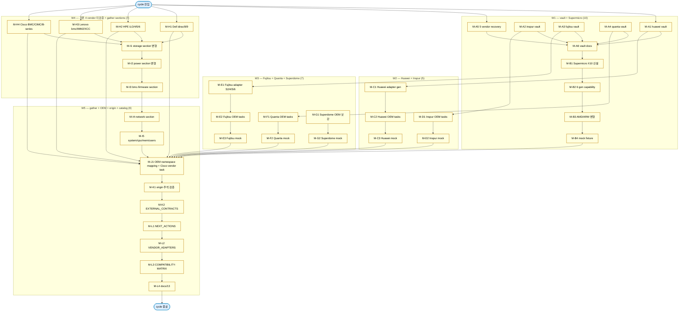

# Dependencies — 2026-05-07 all-vendor-coverage

> 38 ticket 의존 그래프. worker 세션이 [PENDING] + 의존 통과 ticket 식별용.

---

## 의존 그래프 (mermaid)



---

## 의존 매트릭스

| ticket | 의존 (blocked by) | blocks | 시작 가능 시점 |
|---|---|---|---|
| M-A1 (huawei vault) | — | A6, C1, C2, C3 | cycle 진입 즉시 |
| M-A2 (inspur vault) | — | A6, D1, D2 | cycle 진입 즉시 |
| M-A3 (fujitsu vault) | — | A6, E1, E2, E3 | cycle 진입 즉시 |
| M-A4 (quanta vault) | — | A6, F1, F2 | cycle 진입 즉시 |
| M-A5 (5 vendor recovery) | — | A6 | cycle 진입 즉시 |
| M-A6 (vault docs) | A1, A2, A3, A4, A5 | B1 | A1~A5 후 |
| M-B1 (Supermicro X10 신설) | A6 | B2 | A6 후 |
| M-B2 (6 gen capability) | B1 | B3 | B1 후 |
| M-B3 (AMD/ARM 변형) | B2 | B4 | B2 후 |
| M-B4 (mock fixture) | B3 | J1 | B3 후 |
| M-C1 (Huawei adapter gen) | A1 | C2 | A1 후 |
| M-C2 (Huawei OEM tasks) | C1 | C3 | C1 후 |
| M-C3 (Huawei mock) | C2 | J1 | C2 후 |
| M-D1 (Inspur OEM tasks) | A2 | D2 | A2 후 |
| M-D2 (Inspur mock) | D1 | J1 | D1 후 |
| M-E1 (Fujitsu adapter S2/4/5/6) | A3 | E2 | A3 후 |
| M-E2 (Fujitsu OEM tasks) | E1 | E3 | E1 후 |
| M-E3 (Fujitsu mock) | E2 | J1 | E2 후 |
| M-F1 (Quanta OEM tasks) | A4 | F2 | A4 후 |
| M-F2 (Quanta mock) | F1 | J1 | F1 후 |
| M-G1 (Superdome OEM 보강) | — | G2 | cycle 진입 즉시 (HPE vault 이미 존재) |
| M-G2 (Superdome mock) | G1 | J1 | G1 후 |
| M-H1 (Dell idrac/8/9) | — | I1, J1 | cycle 진입 즉시 (Dell vault 이미 존재) |
| M-H2 (HPE iLO/4/5/6) | — | I1, J1 | cycle 진입 즉시 |
| M-H3 (Lenovo bmc/IMM2/XCC) | — | I1, J1 | cycle 진입 즉시 |
| M-H4 (Cisco BMC/CIMC/B-series) | — | I1, J1 | cycle 진입 즉시 |
| M-I1 (storage section) | H1, H2, H3, H4 | I2 | H1~H4 후 |
| M-I2 (power section) | I1 | I3 | I1 후 |
| M-I3 (bmc-firmware section) | I2 | I4 | I2 후 |
| M-I4 (network section) | I3 | I5 | I3 후 |
| M-I5 (system/cpu/mem/users) | I4 | J1 | I4 후 |
| M-J1 (OEM namespace mapping + Cisco) | B4, C3, D2, E3, F2, G2, H1~H4, I5 | K1 | 모든 vendor 영역 후 |
| M-K1 (origin 주석 검증) | J1 | K2 | J1 후 |
| M-K2 (EXTERNAL_CONTRACTS) | K1 | L1 | K1 후 |
| M-L1 (NEXT_ACTIONS) | K2 | L2 | K2 후 |
| M-L2 (VENDOR_ADAPTERS) | L1 | L3 | L1 후 |
| M-L3 (COMPATIBILITY-MATRIX) | L2 | L4 | L2 후 |
| M-L4 (docs/13) | L3 | cycle 종료 | L3 후 |

---

## 진행 가능 ticket 식별 (cycle 진입 시점 기준)

cycle 진입 즉시 진행 가능 (의존 없음): **M-A1, M-A2, M-A3, M-A4, M-A5, M-G1, M-H1, M-H2, M-H3, M-H4** (10 ticket)

W1 worker 가 M-A1~A5 병렬 또는 순차 진행 가능. W3 worker 는 M-G1 진입 가능 (HPE vault 이미 존재). W4 worker 는 M-H1~H4 병렬 가능 (각 vendor vault 이미 존재).

---

## 의존성 검증 절차

worker 세션 진입 시:

```
1. fixes/INDEX.md 에서 본 worker 의 [PENDING] ticket 식별
2. 본 DEPENDENCIES.md 표에서 해당 ticket 의 "의존 (blocked by)" 컬럼 확인
3. 의존 ticket 모두 [DONE] 인지 fixes/INDEX.md 진행 상태 표 확인
4. 통과 → 작업 시작 / 미통과 → 다른 [PENDING] ticket 또는 대기
```

---

## 관련

- INDEX.md (cycle 전체)
- fixes/INDEX.md (38 ticket 진행 상태)
- SESSION-PROMPTS.md (worker별 cold-start 프롬프트)
